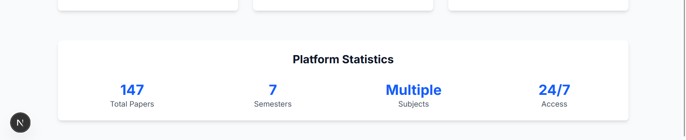

# PaperE

PaperE is a web app that allows users to browse and access academic exam papers by semester and subject (with protected PDF links), powered by Next.js, MySQL..

---

## Features

- Search papers by semester (1–8), view all available subjects, and see links to every matching paper
- Protected PDF access using HTTP Basic Auth (with credentials prompt)
- Modern UI with Next.js and Tailwind CSS
- Python scrapers to build and import full paper metadata from a remote source
- Fast MySQL backend with Dockerized persistence
- Redis in backend for caching and optimisation

---

## Screenshots

<!-- Replace these example paths after deployment -->

### Home Page

### Explore by Semester

### Subject List

---

## Tech Stack

- **Frontend:** Next.js (JavaScript, TailwindCSS)
- **Backend:** Next.js, MySQL (with Docker container)
- **Scraping/Import:** Python (requests, bs4), custom CSV importer
- **Optimisation:** Redis caching
